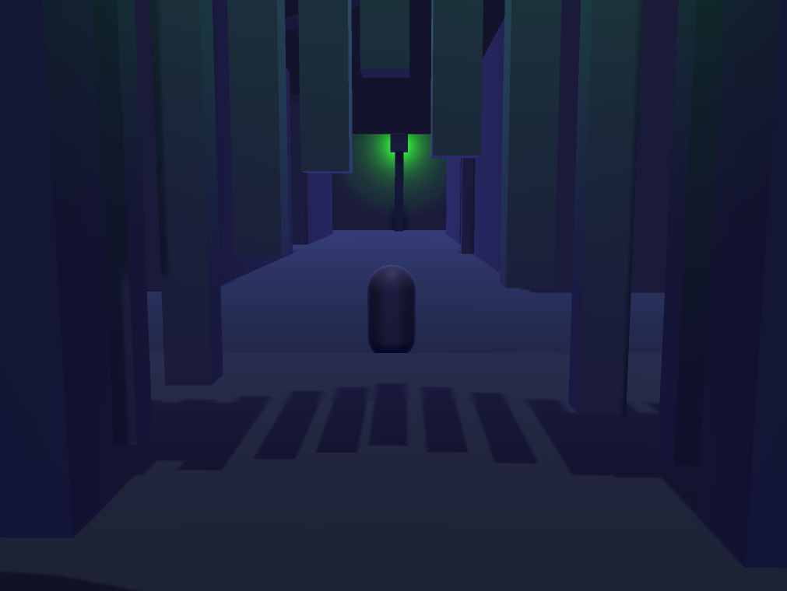
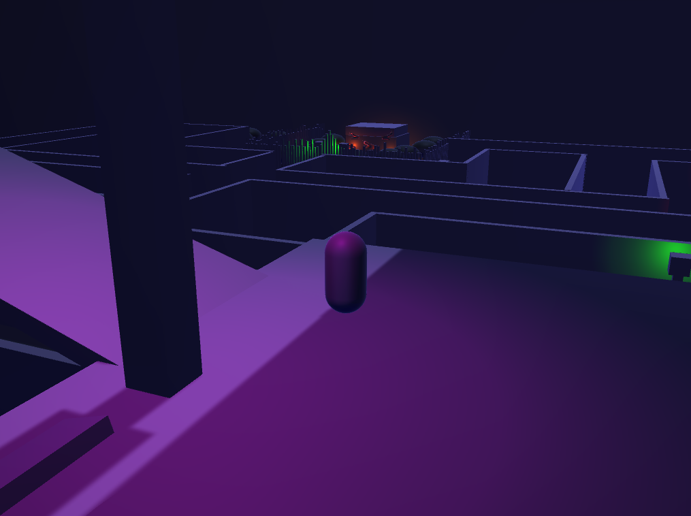
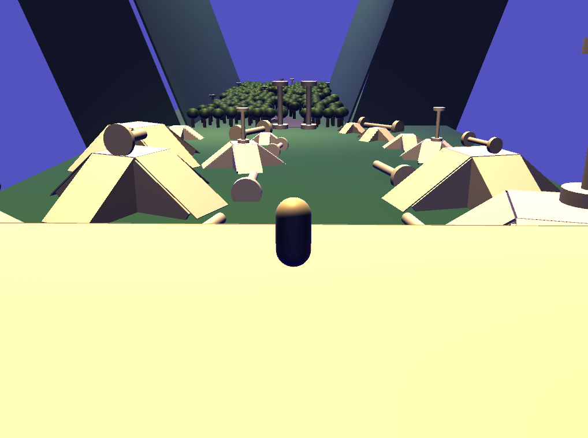
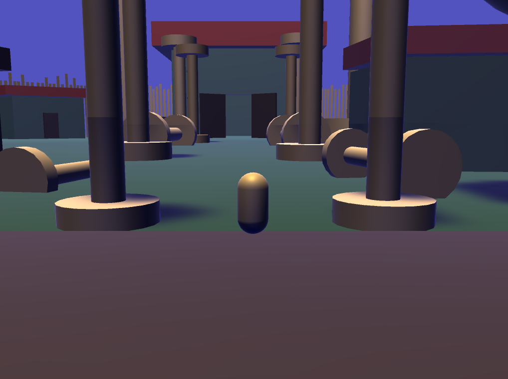

# Refuge, a 3D Whitebox Level
**Contents**  
[1. Info](#info)  
[2. Goal](#goal)  
[3. Results](#results)  
[4. Process](#process)  
[5. What I Would Do Differently](#what-i-would-do-differently)  
[6. What I Learned](#what-i-learned)  
[7. Links](#links)  

## Info
**Date:** Fall 2021  
**Class:** DES 214 (technical level design)  
**Where:** DigiPen Institute of Technology

Made in Unity.  
This project was made in half a semester.

## Goal
Create 3D whitebox level with a Setup, Hook, Development, Turn, and Resolution. Include multiple forms of guidance.

## Results
View at the start of the level entering the maze. The player is standing in a hole in a fence looking at a lamp post with a green light.  

  

View from a height looking down at the maze. The player is standing on a ledge and can see the house they came from in the distance.  

  

View from the top of the "hill" the player gets teleported to. The player is looking out at "hills" and "pillars".  

  

View entering the village at the end of the level. The player is looking at a big house in the distance with tall "pillars" lining a path towards the house.  

## Process
### Setup / Hook / Development / Turn / Resolution
### Guidance

## What I Would do Differently
There are a lot of things I would change about this project and I actually did a rework of it recently. You can see what I did differently from following the link to the new version in the links section below.  

## What I Learned
I think an important 
## Links
[My Portfolio](https://github.com/ksanti6/portfolio)  
[New Version of the Refuge Level](https://github.com/ksanti6/Refuge_Redo)  
