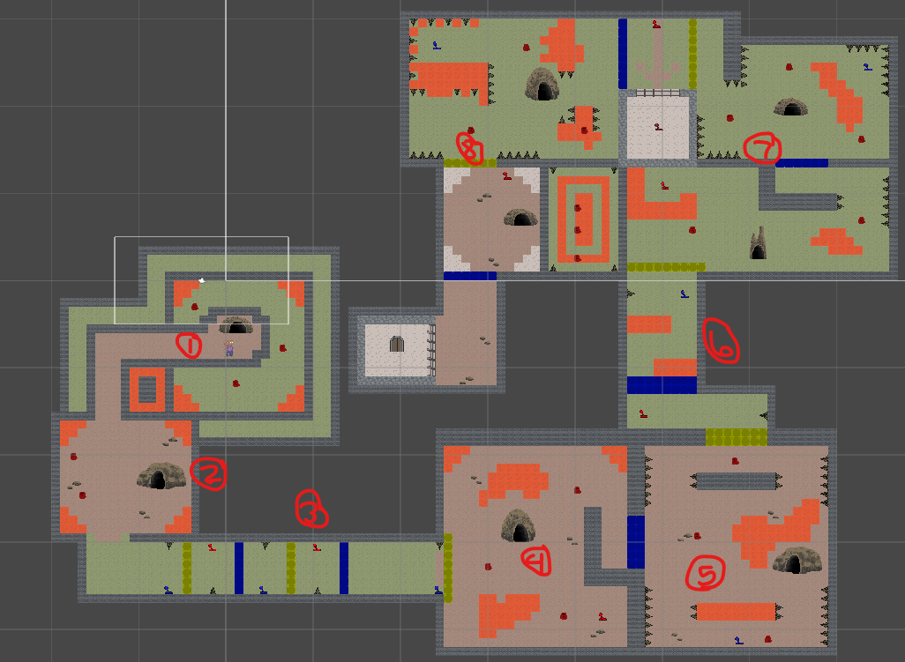
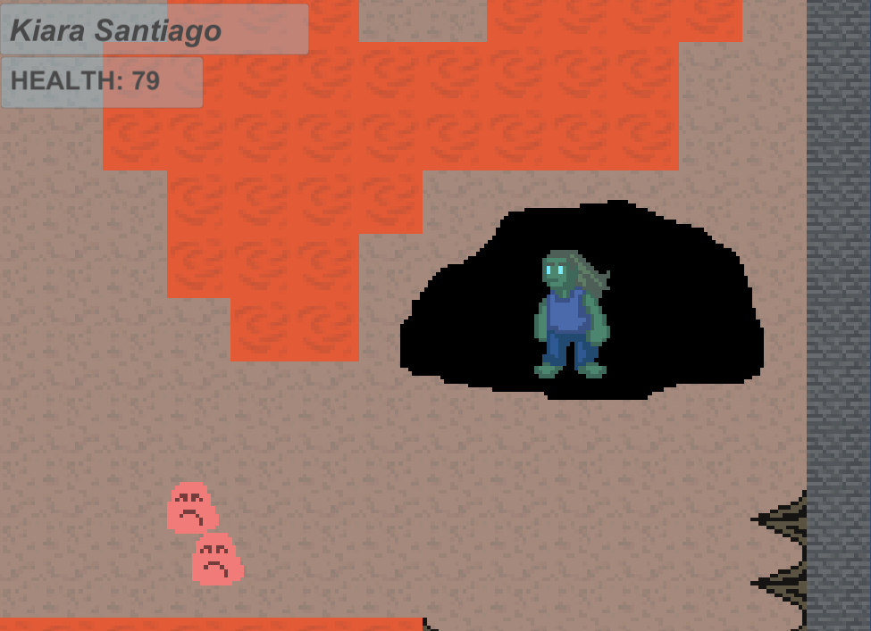

# Hiding Mechanic and its Showcase Level
**Contents**  
[1. Info](#info)  
[2. Goal](#goal)  
[3. Results](#results)  
[4. Process](#process)  
[5. What I Would Do Differently](#what-i-would-do-differently)  
[6. What I Learned](#what-i-learned)  
[7. Links](#links)  

## Info
**Date:** Spring 2022  
**Class:** DES 315 (technical design class)  
**Where:** DigiPen Institute of Technology  

Made in Unity.  

## Goal
Create a gameplay mechanic that can be used in tangent with another student's mechanic. Then create a level to showcase your mechanic and 1 more mechanic.
## Results 
This is an overview of the entire level made. The level is labelled in sections:  
**1:** Setup  
**2:** Hook  
**3, 4, 5, 6, 7:** Development  
**7, 8:** Turn   
**8:** Resolution  

  

This shows closer up what it looks like to the player when inside a cave. The cave is darkened, the player is tinted blue, and the enemies turn a lighter shade of red as they move away.  

  

For close up pictures of each section of the level there are additional pictures in this projects folder.
## Process

When deciding to make my gameplay mechanic I wanted to answer the question:   
**How can the environment aid the player in avoiding taking damage?**  

My answer to this question ended up being "hidey holes" or caves. The player enters the cave to lose aggro from the enemies and has a safe space to plan their next course of action.  

The mechanic I paired with mine is a lever door system. Hitting a lever opens the door associated with its color and closes other doors.  

I thought this mechanic would be an easy way to provide the player a goal for progression. Throughout the level, the only way to progress forward is if you find the lever to unlock the door forward.  

In designing the level I wanted to slowly introduce each mechanic to the player so they can learn the mechanics. In the development they would experience both mechanics in different scenarios. This would build up to the turn where the player would have a "final test" of their knowledge of the mechanics. Then the player would return to safety in the resolution before entering the portal to the next student level.  
## What I Would do Differently
I think there are two things I would do differently.  

### More Feedback
When entering the cave there are minimal visual cues to indicate it is a different (safer) space for the player. If I were to do this again, I would build on those visual cues and even add in some audio cues.  
I think playing with color and audio would be a good way to make it abundantly clear to the player the transition from unsafe to safe.
### More Complicated Level Design
At it stands, the level is linear. Knowing what I do now, I would love to use these mechanics to make a level that has branching pathes and choice for the player. This would elevate the concept of "find the lever to progress" to "find the **correct** lever to progress".
## What I Learned  
I learned a lot about prototyping and iteration from this project. I also learned about working with mechanics made by other people and how to incorporate them with not only my own mechanic, but into an entire level.
## Links
[My Portfolio](https://github.com/ksanti6/portfolio)  