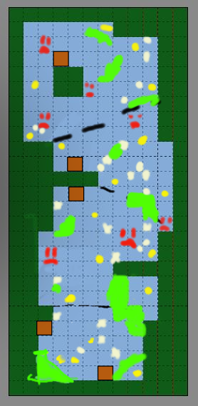

# Sleepless Bayou - 2D Game
**Contents**  
[1. Info](#info)  
[2. Game Concept](#game-concept)  
[3. Work in Each Role](#work-in-each-role)  
[3.1 Production](#production)  
[3.2 Programming](#programming)  
[3.3 Design](#design)  
[4. What I Learned](#what-i-learned)  
[5. Links](#links)  

## Info
**Date:** Spring 2022   
**Class:** GAM 250 (sophmore game project class)  
**Where:** DigiPen Institute of Technology  

**This document is an overview of my contributions to this project, for more indepth look into certain tasks, check out the links at the bottom.**  

Made in a **custom C++ engine.**  
The entire project was made over 2 semesters, but all my work was done in the second semester as that is when I joined the team.  

**Team Composition at time of joining:**  
**Total Members:** 9 (including me!)  
**Disciplines on team:** Art, Design, Programming  
**My Primary Roles:** Associate Producer, Audio Programmer, Level Designer  

## Game Concept
In this 2D horror game, catch fish in an eldritch swamp while avoiding falling prey to a monstrous fish yourself.  

## Work in Each Role
### Production  
As Associate Producer, some of the work I did was:
- run efficient meetings between all disciplines
- ensure the team is on track to complete all milestone requirements
- met with Professors to assess team's progress on rubric

### Programming  
The main two programming tasks I did involved audio and Tiled. Below is a brief overview of those tasks, but if you want to see a more indepth discussion about these topics, there are links at the bottom.  
**Audio**  
I mainly worked on integrating FMOD Core API into the engine. This was a basic integration that read data from a JSON file and allowed for the following functionality:
- playing looping background tracks
- playing sound effects
- pausing all audio
- adjusting the volume of different groups of audio    

**Tiled**  
Another task I worked on was reading Tiled data. This was a basic implementation that read the data from the JSON file(s) exported from the Tiled editor and created game objects based on that data.  

### Design
**Level Design**  
I worked on the initial design of the level before passing it off to be finetuned by the main level designer. The level is shaped like a worm separated into 4 main stages: the tutorial, 2 developmental stages, and the final section.  
Below is what the sketch ended up looking like and what was implemented into the game for the first iteration. Symbols on the sketch explained:
- **brown squares:** docks to drop fish off at
- **dark green:** level boundaries
- **blue:** water
- **bright green:** spots for grass (slows the player down)
- **yellow:** fishing spots
- **white:** firefly spots
- **red frowny face:** where the monster could spawn
- **black dotting lines:** separated level into 4 sections

  

**Tutorial**  
I worked on the tutorial aswell. It was a simple tutorial system comprised of a set of pop-up screens. Some things the tutorial taught the player:
- movement
- how to fish
- how to use a dock
- beware enemies  
The tutorial would trigger when the player got close to areas that pertained to the tutorial subject for the first time. In the entire tutorial area, there were no monsters so the player could safely learn the skills necessary to play the game.

## What I Learned
This project was my first time working on an multiple discipline team to make a finished product.  
I learned a lot about how to communicate across different disciplines and meet in the middle. Also, I learned how to consistently contribute to a long term project with other people in my discipline.  
I was about to greatly grow my skills as a C++ programmer working in a custom engine setting. Not to mention being able to adjust to a new engine system that I didn't help create from the ground up.
## Links
[My Portfolio](https://github.com/ksanti6/portfolio)  
[Sleepless Bayou Trailer](https://youtu.be/ymIgTn1XzcY?si=K_5FM0VcAla2gUNw)  
[Integrating FMOD into a Custom Engine]()  
[Used Tiled with a Custom Engine]()  

